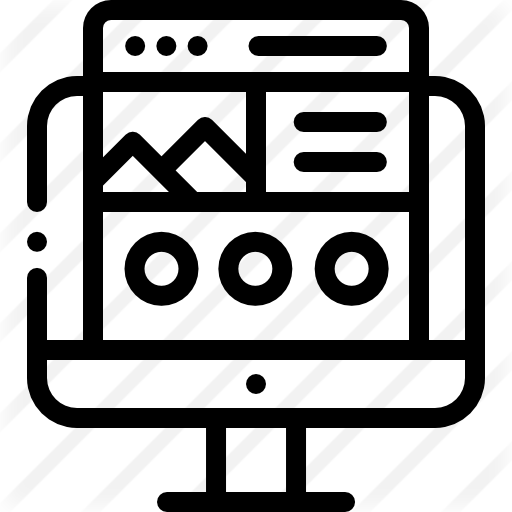

<!--
*** Thanks for checking out the Best-README-Template. If you have a suggestion
*** that would make this better, please fork the repo and create a pull request
*** or simply open an issue with the tag "enhancement".
*** Thanks again! Now go create something AMAZING! :D
-->

<!-- PROJECT SHIELDS -->
<!--
*** I'm using markdown "reference style" links for readability.
*** Reference links are enclosed in brackets [ ] instead of parentheses ( ).
*** See the bottom of this document for the declaration of the reference variables
*** for contributors-url, forks-url, etc. This is an optional, concise syntax you may use.
*** https://www.markdownguide.org/basic-syntax/#reference-style-links
-->
[![Contributors][contributors-shield]][contributors-url]
[![Forks][forks-shield]][forks-url]
[![Stargazers][stars-shield]][stars-url]
[![Issues][issues-shield]][issues-url]
[![MIT License][license-shield]][license-url]
[![LinkedIn][linkedin-shield]][linkedin-url]

<!-- PROJECT LOGO -->
 

  

  <h3 align="center">Landing Page Animation</h3>

  

    An awesome example of landing page animation with GSAP!
     
     
    <a href="https://doomhammerhell.github.io/landing-page-exone">View Demo</a>
    ·
    <a href="https://github.com/doomhammerhell/landing-page-exone/issues">Report Bug</a>
    ·
    <a href="https://github.com/doomhammerhell/landing-page-exone/issues">Request Feature</a>
  

<!-- TABLE OF CONTENTS -->

  
Table of Contents

  <ol>
    <li>
      <a href="#about-the-project">About The Project</a>
      <ul>
        <li><a href="#built-with">Built With</a></li>
      </ul>
    </li>
    <li><a href="#contributing">Contributing</a></li>
    <li><a href="#license">License</a></li>
    <li><a href="#contact">Contact</a></li>
    <li><a href="#acknowledgements">Acknowledgements</a></li>
  </ol>

<!-- ABOUT THE PROJECT -->
## About The Project

[![Landing Page Animation Example][product-screenshot]](https://example.com)

### Built With

* [Ionicons](https://ionicons.com/)
* [TweenMax](https://greensock.com/tweenmax/)
* [ThreeJS](https://threejs.org/)

<!-- CONTRIBUTING -->
## Contributing

Contributions are what make the open source community such an amazing place to be learn, inspire, and create. Any contributions you make are **greatly appreciated**.

1. Fork the Project
2. Create your Feature Branch (`git checkout -b feature/AmazingFeature`)
3. Commit your Changes (`git commit -m 'Add some AmazingFeature'`)
4. Push to the Branch (`git push origin feature/AmazingFeature`)
5. Open a Pull Request

<!-- LICENSE -->
## License

Distributed under the MIT License. See `LICENSE` for more information.

<!-- CONTACT -->
## Contact

Mayckon Giovani - [@CreatorsOfChaos](https://twitter.com/CreatorOfChaos) - mayckonrlyeh@gmail.com

Project Link: [https://github.com/doomhammerhell/landing-page-exone](https://github.com/doomhammerhell/landing-page-exone)

<!-- MARKDOWN LINKS & IMAGES -->
<!-- https://www.markdownguide.org/basic-syntax/#reference-style-links -->
[contributors-shield]: https://img.shields.io/github/contributors/doomhammerhell/landing-page-exone.svg?style=for-the-badge
[contributors-url]: https://github.com/doomhammerhell/landing-page-exone/graphs/contributors
[forks-shield]: https://img.shields.io/github/forks/doomhammerhell/landing-page-exone.svg?style=for-the-badge
[forks-url]: https://github.com/doomhammerhell/landing-page-exone/network/members
[stars-shield]: https://img.shields.io/github/stars/doomhammerhell/landing-page-exone.svg?style=for-the-badge
[stars-url]: https://github.com/doomhammerhell/landing-page-exone/stargazers
[issues-shield]: https://img.shields.io/github/issues/doomhammerhell/landing-page-exone.svg?style=for-the-badge
[issues-url]: https://github.com/doomhammerhell/landing-page-exone/issues
[license-shield]: https://img.shields.io/github/license/doomhammerhell/landing-page-exone.svg?style=for-the-badge
[license-url]: https://github.com/doomhammerhell/landing-page-exone/blob/master/LICENSE.txt
[linkedin-shield]: https://img.shields.io/badge/-LinkedIn-black.svg?style=for-the-badge&logo=linkedin&colorB=555
[linkedin-url]: https://linkedin.com/in/mayckongiovani
[product-screenshot]: images/screencapture.png